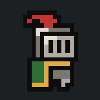

# The Coin Knight 

## [Web](https://sullydux.github.io/The-Coin-Knight/) or [App](https://github.com/sullydux/The-Coin-Knight/releases/latest/)

### **Alpha 4**
v0.4.0

---

## What

Explore a handcrafted pixel art world filled with challenges and hidden secrets. Coins are scattered throughout the world, waiting to be collected. There are scattered flags that act as checkpoints. Save the realm from the slimes and their boss. All of the citezens flee from their presence, so expect to be unaided. Relcaim the looted coins. Restore the kingdom!.

This is my first Godot game and the base game from [Brackeys "How to make a Video Game - Godot Beginner Tutorial"](https://www.youtube.com/watch?v=LOhfqjmasi0).

---

## To add

This game is still in active dev with many more fetures and mechanics.

- Saves
- Boss

### - How I decide version number: X.Y.Z

X is a very major version like 0(alpha) or 1(first finsihed release)
Y is a feture update like adding new functionality or menu buttons
Z is a minor updata like bug fix or changing placement of existing enemy

---

## When

Hopefully v1.0.0 will be released mid or late July.

---

## Thanks

[Brackeys Itch.io asset page](https://brackeysgames.itch.io/brackeys-platformer-bundle) for tile maps, sounds, slimes, character, and coins

[CosmicOnion's Medival Weapons asset pack](https://cosmiconion.itch.io/32x32-medieval-weapons-pixel-art-pack?download) for sword asset

[Cainos' Pixel Art Platformer - Village Props](https://cainos.itch.io/pixel-art-platformer-village-props) for the flags