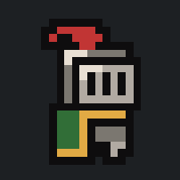

# The Coin Knight 

### Release 3
v1.4.1

[Web](https://sullybase.github.io/Coin/) or [App](https://www.patreon.com/collection/2257757)

---

**Official Website:** https://sullybase.github.io/Coin/

**Developer:** [Sullydux](https://github.com/sullydux)

**Contact Me:** [Go to contact me page](https://sullydux.github.io/sullydux/email.html)

**Patreon & Download:** [Patreon collection](https://www.patreon.com/collection/2257757)

---

Explore a handcrafted pixel art world packed with challenges and hidden secrets, all within a tightly designed map. Coins are scattered throughout the environment, rewarding careful exploration and clever platforming. Scattered flags act as checkpoints, letting you push forward without losing progress when you fall. The realm is under siege by slimes and their fearsome boss, causing all citizens to flee in fear. With no help from them, you must face the threat alone. Battle through slime-infested areas, recover the looted coins, and restore peace to the kingdom in this intense adventure. You are the knight who shall recover the realm!

---

This is a 2D pixel art game I made for fun. It is my first Godot game, so I was and am still learning. It automatically saves periodically, but to be safe, just hit save.

It is available as a Windows, Linux, or Mac app and on a website. It is unsigned because I am unable to pay for applicable platforms.

It has controller support, which is tested on mac app.

---

## Controls:

### Movement
| Action | Keyboard | PlayStation | Xbox | Nintendo |
|---|---|---|---|---|
| **Move Right** | `D` / `→` | `L-Stick Right` / `D-Pad Right` | `L-Stick Right` / `D-Pad Right` | `L-Stick Right` / `D-Pad Right` |
| **Move Left** | `A` / `←` | `L-Stick Left` / `D-Pad Left` | `L-Stick Left` / `D-Pad Left` | `L-Stick Left` / `D-Pad Left` |
| **Move Up** | `W` / `↑` | `R-Stick Up` / `○` / `D-Pad Up` | `R-Stick Up` / `B` / `D-Pad Up` | `R-Stick Up` / `A` / `D-Pad Up` |

### Menus
| Action | Keyboard | PlayStation | Xbox | Nintendo |
|---|---|---|---|---|
| **Open Menu** | `Esc` | `□` | `X` | `Y` |
| **Accept** | `Enter` / `Space` | `✕` / `R2` | `A` / `RT` | `B` / `ZR` |
| **Decline** | `Shift` | `○` / `L2` | `B` / `LT` | `A` / `ZL` |
| **Advance** | `Space` / `Enter` | `R2` / `✕` | `RT` / `A` | `ZR` / `B` |

### Actions
| Action | Keyboard | PlayStation | Xbox | Nintendo |
|---|---|---|---|---|
| **Attack** | `Space` / `↓` | `R1` / `R2` / `D-Pad Down` | `RB` / `RT` / `D-Pad Down` | `R` / `ZR` / `D-Pad Down` |

---

## Updates:

This game is still in active dev with more features and mechanics. It is a hobby project.

### v1.4.2 — Audio

- Add music for boss and other non boss track
- Add sounds: enemy killed, death

### v1.5 — New Land Expansion

**New area**
- Second arena for later-game use
- Path to reach it
- Hidden portal, hinted at on the map
- Hidden portal in the cave leading to the new land
- Shop placed near the portal entrance

**Enemies**
- New enemy: spider, walking type, takes 3 hits

**Shop**
- Attack damage rune
- Revive potions
    - Find in scattered envirment
- Dash rune

**Progression**
- Map becomes a buyable item

**UI**
- % complete in pause menu (30% boss, 70% coins — enemy drops feed coin %)

### v1.5.1 — Menu and Settings

**UI**
- % complete in pause menu 
    - (30% boss, 70% coins — enemy drops feed coin %)
	  Or
    - (30% boss, 40% coins, 30% enemies)

**Settings**
- keybinds
- volume (0-200%)

---

## How was made

Made on Godot 4.6.3-stable with M2 Macbook Air 8GB RAM.
Later made on Godot 4.7.1-stable with Macbook Pro M5 Pro 24GB RAM.

Tested on the same computer it was created on. Tested Windows on VMware Fusion Windows 11 and Linux on VMware Fusion Fedora Linux. Both were 64-bit ARM.

---

## Thanks

This is my first Godot game and the base of the game was from [Brackeys "How to make a Video Game - Godot Beginner Tutorial"](https://www.youtube.com/watch?v=LOhfqjmasi0).

[Brackeys Itch.io asset page](https://brackeysgames.itch.io/brackeys-platformer-bundle) for tile maps, sounds, slimes, character, and coins

[Cainos' Pixel Art Platformer - Village Props](https://cainos.itch.io/pixel-art-platformer-village-props) for the flags, spikes, chain door, and magic rocks

[Anokolisa' Pixel Crawler - Free Pack](https://anokolisa.itch.io/free-pixel-art-asset-pack-topdown-tileset-rpg-16x16-sprites) for the wizard and boss rock attack

[Runica's Pixel Menu Box + Buttons](https://runica.itch.io/pixel-menu-box-buttons) for text boxes

[Caio's Raven Fantasy Icons](https://clockworkraven.itch.io/raven-fantasy-icons) for the key, rune, and map item

[Elvgames' Inventory Asset Pack](https://elvgames.itch.io/free-inventory-asset-pack) for hearts and boss bar

[Refo's NPC and Enemies](https://refo.itch.io/npc-and-enemies) for non Wizard NPC

[Seliel the Shaper's Moody Mushroom](https://seliel-the-shaper.itch.io/moody-mushroom) for mushroom assets(I edited for my use case)

'Menu Music' on pixabay — music

Me(sullydux) for sword and map view asset

---

## Legal

This project is licensed under the terms found here:

[View License](https://sullybase.github.io/Coin/LICENSE.txt)